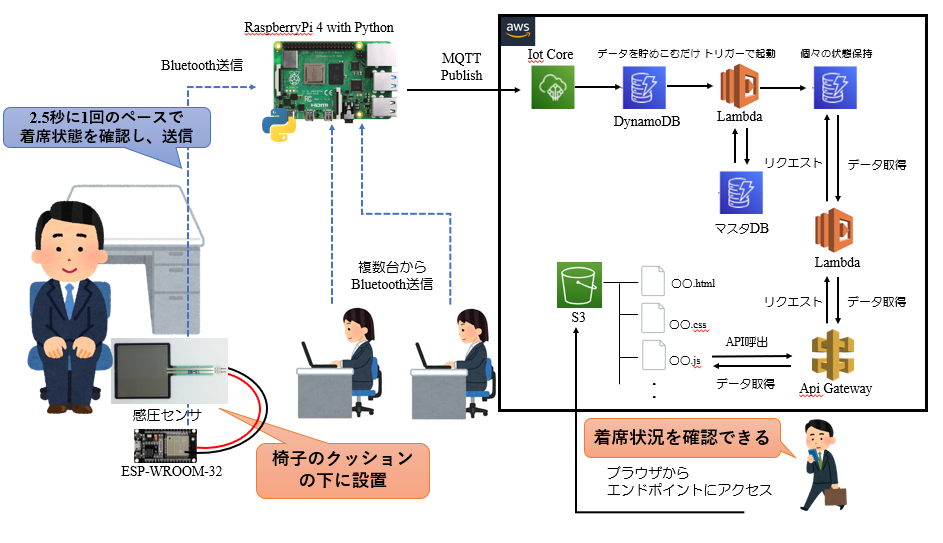
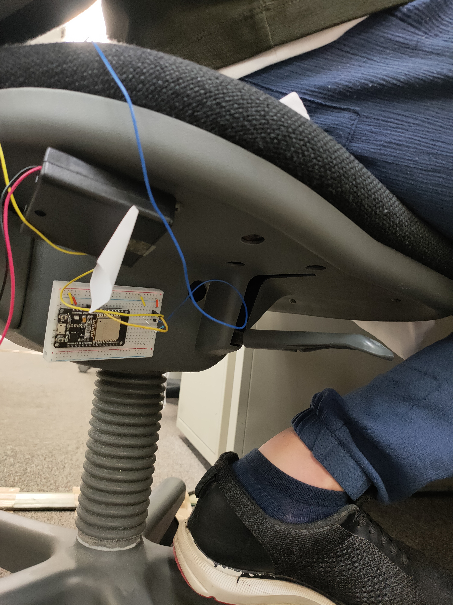
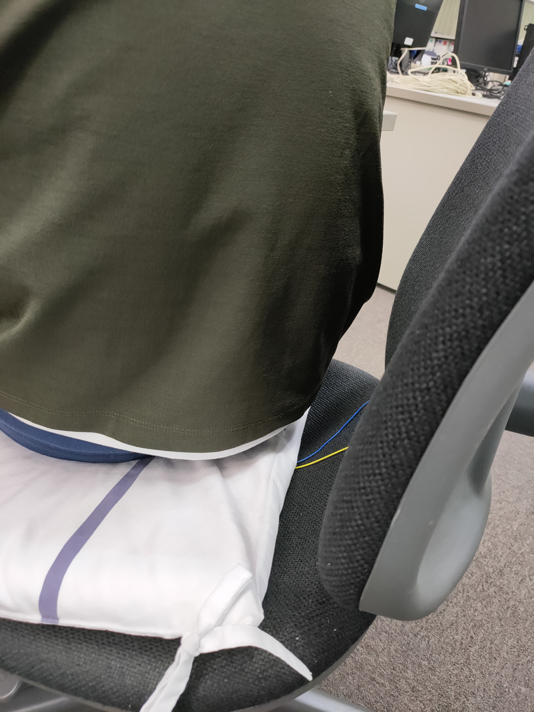
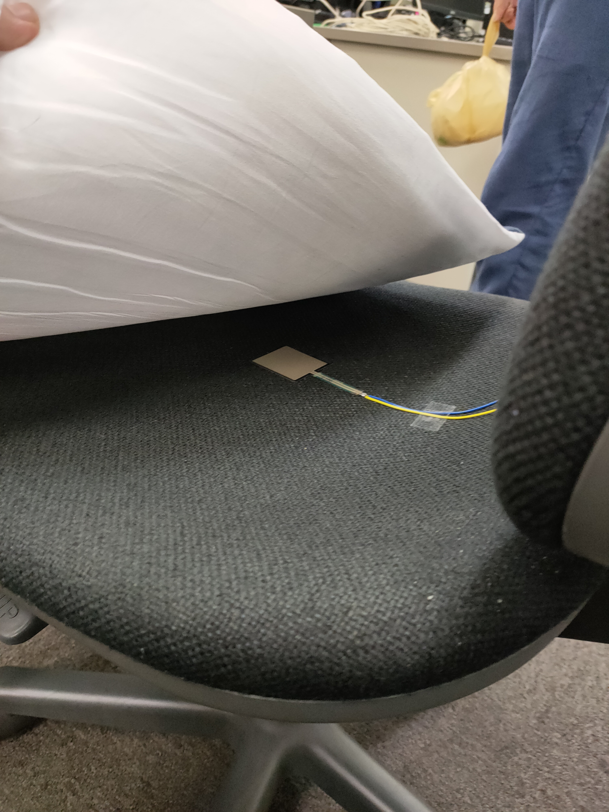
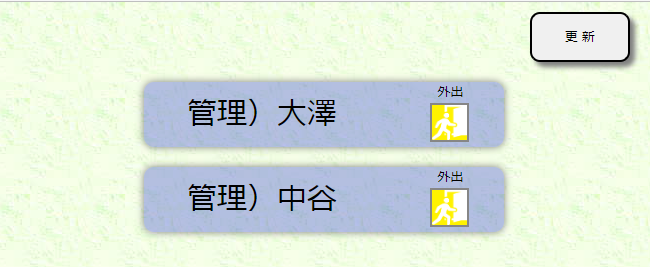

# 外部使用  

## システム構成図  

- 人感センサを利用したシステム構成図  

  

- 感圧センサを利用したシステム構成図（AWS側も少し変更）  

  

以下、感圧センサを利用したシステムの外部使用を説明する  

## 椅子の状況  

クッションの下にESP32に接続された感圧センサを設置する  
ESP32は乾電池4本で動作  

  座席の裏にESP32を貼り付け（電池駆動）
    
  座席に座布団を引いて・・・
  
  その裏に感圧センサーを配置 
    

## Web画面  

画面は2画面用意する  
- 閲覧者用画面  
各管理者の着席状態が見れる  
更新ボタンで着席状態を更新できる  
更新ボタンを押さなくても、3秒ごとに着席状態を自動で更新する  
  

- 管理者用画面  
閲覧者用画面にテレワークボタンを追加  
テレワークボタンを押すと、着席状態のところが「テレワーク」となり  
もう一度ボタンを押すまで、「テレワーク」状態は解除されない  
.png)  

