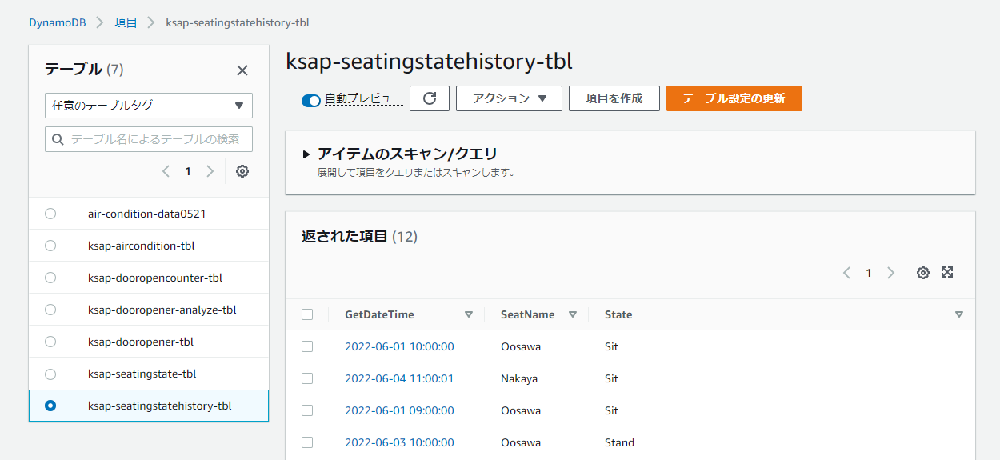
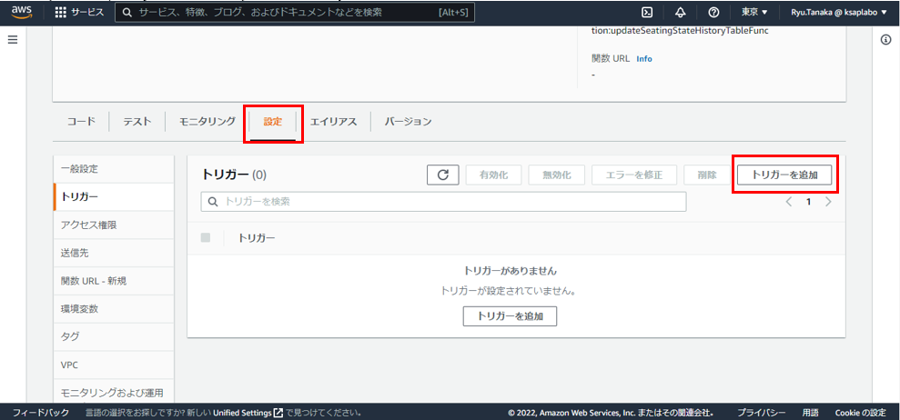
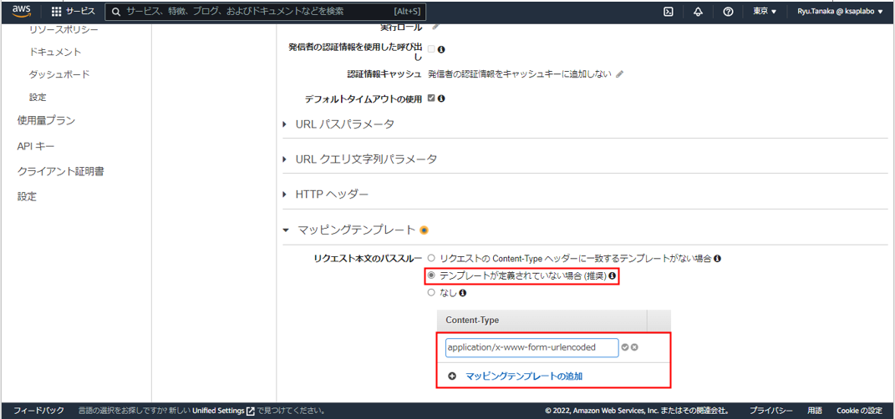

# SeatMotionSensor

## 目次  
- [全体概要](#content1)  
- [ESP32で人感センサの操作](#content2)  
- [Raspberry Piでデータ送受信](#content3)  
- [モノの作成](#content4)  
- [DynamoDBの作成](#content5)  
- [IAMロールの作成](#content6)  
- [Lambdaの作成](#content7)  
- [API Gatewayの作成](#content8)  
- [公開するWebアプリケーションの作成](#content9)  
- [S3での公開方法](#content10)  
- [残課題](#content11)  
- [感圧センサの利用](#content12)

<h2 id="content1">全体概要</h2>  

  

支店管理部の在籍情報をリアルタイムで知ることができるシステムの開発  

※以下は人感センサを利用したシステムの説明を行う
※各ソースは感圧センサを利用したコーディングとなっているため  
  人感センサを利用したソースはHistoryから参照  

・システム説明  
図の左半分：管理部の座席足元に人感センサを設置して、1秒単位で席にいるかどうかをESP32でキャッチ  
           それを30秒間続けて、30秒に1回着席情報をRaspberry Piへ送信  
           それを受け取ったRaspberry PiがIoT Coreへパブリッシュする  

図の右半分：IoT Coreの受信をトリガーに、DynamoDBへ日時をキーとしてデータ登録  
           このデータ登録をトリガーとして、もう一つのDynamoDBに座席名をキーとしてデータ登録  
           S3の静的ホスティングサービスを使い、公開されたURLに利用者はアクセスする。  
           S3に保存してある、JavaScriptからAPIGateway、Lambdaを介して在籍情報を取得  
           データを成形して、ブラウザ上に表示する  

文章での説目では分かりずらいので、それぞれの機能実装手順を以下にしてしていく  


<h2 id="content2">ESP32で人感センサの操作</h2>  

人感センサの仕組みについては[こちら](./%E6%8A%80%E8%A1%93%E8%AA%BF%E6%9F%BB.md)を参照  

ESP32と人感センサの配線は以下のように組む  
  

ソースは以下のようになる  
[seatmotionsensor.ino](./ino/seatmotionsensor.ino)  

Arduino IDEを使用して、ソースをコンパイルする  
Arduino IDEの使い方は[こちら](https://github.com/ksaplabo-org/ksapDoorOpener#esp32%E3%81%8B%E3%82%89servo%E3%82%92%E5%8B%95%E3%81%8B%E3%81%99)を参照  


<h2 id="content3">Raspberry Piでデータ送受信</h2>  

Raspberry Piのセットアップは[こちら](https://github.com/ksaplabo-org/Raspi-Setup)を参照  

各ライブラリのインストールが必要  
- MQTT通信するためのライブラリ  
```
$ pip3 install paho-mqtt python-etcd
```
- bluetoothを使用するためのライブラリ  
```
$ sudo apt-get install python3-pip libglib2.0-dev
$ sudo pip3 install bluepy
```

ソースは以下のようになる  
[logget.py](./py/logger.py)  
[main.py](./py/main.py)  
[motion_detector.py](./py/motion_detector.py)  


<h2 id="content4">モノの作成</h2>  
 
Iot Coreで「モノ」の作成  
作成方法については[こちら](https://github.com/ksaplabo-org/aircondition#awsiot-core%E3%81%A7%E3%83%A2%E3%83%8E%E6%83%85%E5%A0%B1%E3%82%92%E4%BD%9C%E6%88%90)を参照  
モノの名前は任意で作成  

MQTTテストクライアントで受信するとこを確認出来たら、DynamoDBの作成を行う  


<h2 id="content5">DynamoDBの作成</h2>

今回はDynamoDBを2つ用意する。  
1.受信したデータを全て登録するDynamoDB  
2.座席名ごとに着席情報を管理するDynamoDB  

1.受信したデータを全て登録するDynamoDB  

DynamoDBを作成方法は[こちら](https://github.com/ksaplabo-org/aircondition#aws%E5%8F%97%E4%BF%A1%E3%81%97%E3%81%9F%E3%83%87%E3%83%BC%E3%82%BF%E3%82%92dynamodb%E3%81%AB%E7%99%BB%E9%8C%B2%E3%81%99%E3%82%8B)を参照  
今回作成するDynamoDB名は以下の通り ※名前は任意  
DynamoDB名：ksap-seatingstatehistory-tbl  

DynamoDBのコンソール画面から「テーブル」＞「項目の探索」を選択し  
作成したDynamoDBを選択  
「項目の作成」を選択して、以下のテストデータを作成  

  

項目名は任意だが、この後のソースでこの名前を使用するため後で迷わないように  

2.座席名ごとに着席情報を管理するDynamoDB  

1と同様の手順でテストデータまで作成  
DynamoDB名：ksap-seatingstate-tbl  

  
  


<h2 id="content6">IAMロールの作成</h2>

LambdaがDynamoDBにアクセスするためのIAMロールを作成  

IAMコンソール画面の左ペインから「ロールを選択」  
「ロール」の設定画面から「ロールの作成」ボタンを選択  
  

「信頼されたエンティティタイプ」はデフォルトの「AWSのサービス」を選択  
「ユースケース」は「Lambda」を選択し、「次へ」を選択  
  

「許可を追加」画面で以下の二つのポロしーを選択して、「次へ」を選択  
・AmazonDynamoDBFullAccess  
・AWSLambdaDynamoDBExecutionRole  
  

「ロール名」に「LambdaAccess2DynamoDB」と入力し、右下の「ロールを作成」を選択  
  
  

ロールの作成が完了するとロールの一覧に「LambdaAccess2DynamoDB」が登録されます  
  


<h2 id="content7">Lambdaの作成</h2>

  

Lambdaを2つ用意する  

1.ksap-seatingstatehistory-tblへのデータ登録をトリガーに  
SeatNameをキーにして、ksap-seatingstate-tblにデータをUpdateする関数  
(関数名：updateSeatingStateHistoryTableFunc)  

2.APIGatewayからのリスエストをトリガーに  
ksap-seatingstate-tblのデータを取得する関数  
(関数名：getSeatingStateTableFunc)  

1.updateSeatingStateHistoryTableFunc  

Lambdaコンソールから「関数の作成」を選択  
  

オプションはデフォルトの「一から作成」を選択  
関数名は「updateSeatingStateHistoryTableFunc」を入力  
ランタイムは「Python3.9」を選択  
アーキテクチャはデフォルトのまま  
  

「デフォルトの実行ロールの変更」を開き  
「既存のロールを使用する」を選択  
既存ロールの一覧から先ほど作成した「LambdaAccess2DynamoDB」を選択  
詳細設定はそのままで、関数の作成を選択  
  

「コードソース」に以下のソースをコピーして貼り付けする  
[updateSeatingStateHistoryTableFunc.py](./lambda/updateSeatingStateHistoryTableFunc.py)  
  

ソースの説明  
2行目：DynamoDBへの接続はboto3というライブラリを使用  
8-13行目：テーブルに更新されたデータを取得  
19-20行目：「ksap-seatingstate-tbl」のテーブルオブジェクトを取得  
23-26行目：「ksap-seatingstate-tbl」へデータ更新  

ソースを作り終えたら、トリガーの設定を行う  
「設定」タブを選択し、「トリガーを追加」を選択  
  

「トリガーを選択」のプルダウンから「DynamoDB」を選択し  
「DynamoDBテーブル」は「ksap-seatingstatehistory-tbl」を選択  
後の設定はデフォルトのまま、右下の「追加」を選択  
  

関数の定義画面に戻るので、そこでDynamoDBがトリガーに追加されています  
  

以上で1つ目の関数の作成は終わり  

<br>
2.getSeatingStateTableFunc  

updateSeatingStateHistoryTableFuncと同様の出順で作成  
※関数名「getSeatingStateTableFunc」とする  
※トリガーにDynamoDBの登録はしません  
以下のソースをコピペしてください  
[getSeatingStateTableFunc.py](./lambda/getSeatingStateTableFunc.py)  

ソースの説明  
4-5行目：「ksap-seatingstate-tbl」のテーブルオブジェクトを取得  
10-14行目：テーブルデータを読み取り、読み取ったデータをreturnする  


<h2 id="content8">API Gatewayの作成</h2>

lambda関数「getSeatingStateTableFunc」へリクエストするためのGatewayを作成します  

コンソール画面から「APIを作成」を選択  
  

APIタイプを選択の中の上から3つ目の「REST API」を選択  
  

API名を「SeatMotionAPI」とし、他の設定はデフォルトのまま「APIの作成」を選択  
  

画面が遷移したら、アクションから「リソースの作成」を選択　　
  

リソース名を「SeatMotionResource」にし、「リソースの作成」を選択  
  

アクションから「メソッドの作成」を選択し、プルダウンの中から「POST」を選択  
選択すると、横にチェックマークが出てくるので、チェックマークをクリックする  
すると、以下の画面が出てくるので、Lambda関数のところに「getSeatingStateTableFunc」と入力し  
「保存」を選択する　　
  

「Lambda関数に権限を追加する」というダイアログが出てくるので、「OK」をクリック  

アクションから「CORSの有効化」を選択し、「CORSを有効化して～～」を選択する  
  

「メソッド変更の確認」ダイアログが表示されるため、「はい、既存の値を置き換えます」をクリック  

リソースツリーで「POST」を選択している状態で、右の「統合リクエスト」を選択  
  

下の方に「マッピングテンプレート」があるので、そこを選択し  
リクエスト本文のパススルーで、「テンプレートが定義されていない場合（推奨）」を選択  
「マッピングテンプレートの追加」を選択し、テキストに「application/x-www-form-urlencoded」を入力し
チェックマークをクリックする  
  

テンプレートの生成は「メソッドリクエストのパススルー」を選択し、「保存」をクリック  
  

アクションから「APIのデプロイ」を選択するとダイアログが表示されるので  
「デプロイされるステージ」欄に「[新しいステージ]」を選択  
「ステージ名」を「APIseatstage」にし「デプロイ」をクリックする  
  

APIseatstage ステージエディターにあるURLは後で使用するため、コピーしておく  
  


<h2 id="content9">公開するWebアプリケーションの作成</h2>  

  

S3の静的ホスティングサービスを使用して公開するソースを作成する  

- html  
ソースはこちら[SeatingInfo.html](./ksap-seatmotion/SeatingInfo.html)  
※ソース説明  
18-20行目：更新ボタンの設定  
22-31行目：着席状態を表示するためのスケルトン  
           (javascriptで子のスケルトンをコピーして、名前と着席情報を表示する)  

- css  
ソースはこちら[style.css](./ksap-seatmotion/assets/css/style.css)  
※ソースの説明は省略する  
- img  
状態更新表示用の画像[img](./ksap-seatmotion/assets/img/)

- javascript
ソースはこちら[main.js](./ksap-seatmotion/assets/js/main.js)  
ソースはこちら[subMain.js](./ksap-seatmotion/assets/js/subMain.js)  
※ソース説明(main.js)  
1行目：API GatewayでメモしたURLを記載するが、URLの語尾に"/seatmotionsource"を追加する  
6,12-32行目：API Gatewayにリクエストし、取得したデータから画面構築を行う関数  
9行目：3秒に1回着席状態の更新を行う  

ファイル構成はこのようになる  
  

これをS3上で公開する  

<h2 id="content10">S3での公開方法</h2>  


<h2 id="content11">残課題</h2>  

#### システムの精度が悪い  

座っているのに「外出」と表示されることがある  
→人感センサ（モーションセンサ）を使っているため、動きがないと検知できない  

#### テレワーク時はテレワークしていることを分かるようにしたい  

公開するHTMLを2種類用意  
・在席確認画面(いまあるやつ→SeatingInfo.html)  
・テレワーク登録画面付き在席確認画面(新しく作る)  

管理部の人たちには登録できる画面を公開し、一般には閲覧用の画面教える  


<h2 id="content12">残課題解決</h2>  

### システム精度の問題  

感圧センサを利用することで解決した  
システム構成図は[こちら](https://github.com/ksaplabo-org/KsapSeatMotionSensor/blob/master/external%20specification.md#%E3%82%B7%E3%82%B9%E3%83%86%E3%83%A0%E6%A7%8B%E6%88%90%E5%9B%B3)を参照  

ESP32と感圧センサの配線図を以下に示す  
  

感圧センサを使うことにより、着席情報を動体検知ではなく圧力検知になったため  
着席情報を取得する精度が上がった  

### テレワークボタンを追加  

公開するWeb画面を管理者用と閲覧者用に分け、管理者用の画面にテレワークボタンを追加した  
機能については[こちら](https://github.com/ksaplabo-org/KsapSeatMotionSensor/blob/master/external%20specification.md#web%E7%94%BB%E9%9D%A2)を参照  

