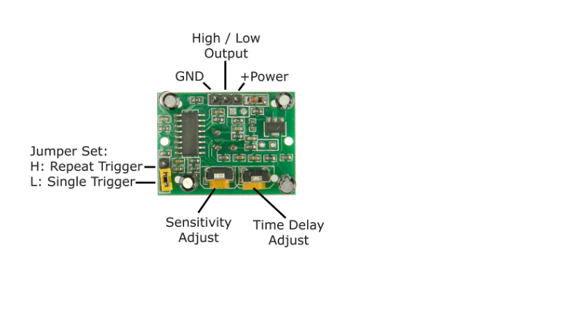

## 人感センサ(HC-SR501)について

人感センサといいつつ、実はモーションセンサーで、センサーの範囲内でモノが動かないと  
検知を行わない  

電源は4.5~20V(ESP32から5.0V出力可能)

つまみが二つ付いていて  
一つはセンサー感度で、センサーが感知する処理を設定できる(3~7m)  
もう一つは時間調整で、センサーがONになった時、ONを維持する時間を調整できる(5~200s)  

 

一番左に回すと、一番小さい値になるため、どちらも最小にすると  
感度:3m  
時間:5s 

試しに動かしてみる  
→検知する時間は最小で5秒とあるが、実際に動かしてみると、1秒くらいでも検知している  

参考：https://hellobreak.net/raspberry-pi-hc-sr501-0912/  

## 試作  

足元に人感センサ(HC-SR501)を設置して、反応があれば、Raspberrypiでキャッチする  
→できた  
ESP32でも試してみる  
→できた  
ESP32の電源を単三電池3本で試してみる  
→たぶんできてる（外部的な確認ができていない）  

## S3について  

```
S3とはデータを格納・管理できるオブジェクトストレージサービスです。
```

### S3でHTMLを公開  

以下のサイトを参考にやってみる  
https://qiita.com/d-yoshizaki-sss/items/c50ec1e30a08d72c2dec

test.htmlを公開することができた  
アップロードするファイル名を「index.html」にするとうまくいかない  

### 公開したHTMLにJavascriptを実行させる  

- SDK(Software Development Kit)
```
あるシステムに対応したソフトウェアを開発するために必要なプログラムや文書窓をひとまとめにしたパッケージ
```

scriptタグを設定すればJavascriptの実行はできた  
→test.html


## 参考になりそうなサイト  

- S3,DynamoDB,Lambda,API Gatewayを利用したクラウドサービスの作成  
https://qiita.com/skikuchi1030/items/b27384d3f7589c3556b5  

S3のバケット名：ksap-seatmotionsensor  

DynamoDBに項目を増やす方法  
テーブル＞項目の探索から右上の「項目を作成」ボタンから可能  

→API Gateway辺りで分からなくなる  

## LambdaとAPI Gatewayの使い方  

参考サイト  
https://business.ntt-east.co.jp/content/cloudsolution/column-try-20.html#section-04  

今のアカウントだと、APIが作成できない  

→APIGatewayを作成して、このサイト通りのことはできた  

## 静的ホスティングをHTTPSで実現する方法  
S3のバケット名がksap-staticwebpagesのバケットに、自分のフォルダをアップロードして  
福島さんのURLの最後の部分の名前を自分のフォルダ名にしたら、HTTPSになる

## GETとPOSTの違い  
大きな違いは 
・GET  ページを「取得」するためのリクエスト  
・POST 情報を「送信」するためのリクエスト  
参考：https://blog.senseshare.jp/get-post-method.html  

## S3のドメイン（福島さんのファイルフォルダ）情報  
https://d17rjxxyw6f0pl.cloudfront.net/  
この後ろに自分のフォルダ名をつける  
https://d17rjxxyw6f0pl.cloudfront.net/ksap-seatmotion/SeatingInfo.html

## 髙田さんからの参考URL  
https://qiita.com/tanj/items/e4486f9af5d7a903117d  
→これ通りやるとできた  

## 電池残高
大澤さん席の電池残高(朝１で計測）
6/13 6.56V  
6/14 6.47V  

中谷さん
6/14 6.58V